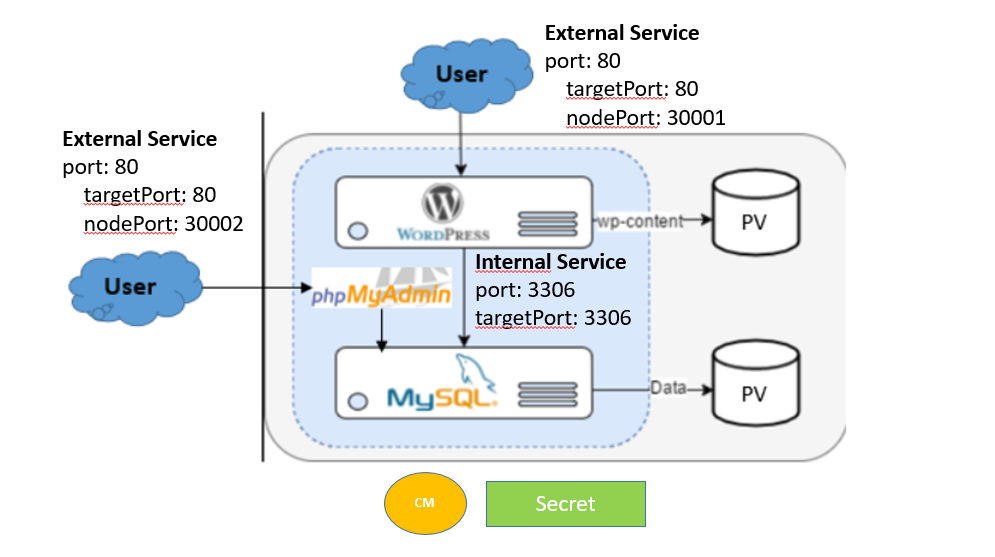

## PV and PVC - MySQL Deployment + Wordpress + PhpMyAdmin
<p align="center">
    
</p>

<div style="text-align: justify">

### PV and PVC - MySQL Deployment + Wordpress + PhpMyAdmin
The following config file describes a single-instance MySQL Deployment. The MySQL container mounts the PV at `/var/lib/mysql`. The `MYSQL_ROOT_PASSWORD` environment variable sets the database password from the Secret.

1. Web Application (Wordpress)
2. MySQl Database
3. Phpmyadmin
4. Kubernetes resources
    - ConfigMaps
    - Secrets
    - Deployments
    - Services (ClusterIP, NodePort)
    - Volumes (PV, PVC)

## What is MySQL ?
MySQL is a popular open-source Relational Database Management System (RDBMS) that uses SQL (Structured Query Language) for database operations. While MySQL is a specific database system accessible for free and supports various programming languages.

MySQL is a popular choice for managing relational databases for several reasons:

1. **Open Source**: MySQL is open-source software, which means it’s free to use and has a large community of developers contributing to its improvement.

2. **Relational**: MySQL follows the relational database model, allowing users to organize data into tables with rows and columns, facilitating efficient data storage and retrieval.

3. **Reliability**: MySQL has been around for a long time and is known for its stability and reliability.

4. **Performance**: MySQL is optimized for performance, making it capable of handling high-volume transactions and large datasets efficiently.

5. **Scalability**: MySQL can scale both vertically and horizontally to accommodate growing data and user loads. You can add more resources to a single server or distribute the workload across multiple servers using techniques like sharding or replication.

6. **Compatibility**: MySQL is widely supported by many programming languages, frameworks, and tools. It offers connectors and APIs for popular languages like PHP, Python, Java, and more, making it easy to integrate with your existing software stack.

7. **Security**: MySQL provides robust security features to protect your data, including access controls, encryption, and auditing capabilities. With proper configuration, you can ensure that only authorized users have access to sensitive information.


## What is PhpMyAdmin ?

phpMyAdmin is a free, open-source tool that allows users to manage MySQL and MariaDB databases. It's a web-based graphical user interface (GUI) that simplifies tasks like creating, modifying, and deleting databases, tables, and records. 

Features:
- **Database administration**: Create, modify, and delete databases, tables, and records 
- **Run queries**: Run SQL commands to perform operations on a database 
- **Add user accounts**: Create and manage user accounts for a database 


## What is Wordpress ?

WordPress is a free and open-source content management system (CMS) that allows users to create and manage websites. It was originally designed for blogging but has since evolved to support other types of content. 

**Features**:
- **Plugins and themes**: WordPress has a large selection of plugins and themes that can be used to customize websites 

-**Integration**: WordPress integrates easily with other services, such as search engines, social media, and payment systems 

- **Flexibility**: WordPress is flexible and can be used to create many different types of websites, including blogs, portfolios, and online stores 

- **User-friendly**: WordPress is easy to use and manage, even for beginners 

**Uses:**
- **Blogging**: WordPress has built-in features for writing blog posts, categorizing content, and reviewing comments 

- **Portfolios** : WordPress can be used to create portfolios 

- **E-commerce**: WordPress can be used to create online stores 

- **News sites**: WordPress is used by many news sites 

- **Membership sites**: WordPress can be used to create membership 

- **Learning management systems**: WordPress can be used to create learning management systems 

## Project explained

- Persistent Volume (PV) is attached to the MySQL Database and used with a Persistent Volume Claim (PVC) object.
- PhpMyAdmin is used for MySQL Database administration where we connect to the Database for creating/removing/updating items.
- PhpMyAdmin has access to the database by the internal service (ClusterIP).
- Users utilize PhpMyAdmin to administrate the MySQL Database. PhpMyAdmin, located in the cluster, is accessible through a web browser using an external connectivity service (NodePort).
- The webapp Wordpress communicates with the MySQL Database using an internal service (ClusterIP).
- Users use a web brower to get access to the webapp Wordpress in the cluster through an external service (NodePort).
- ConfigMap helps to store non-confidential data in key-value pairs such as the url to the MySQL Database.
- Secret stores sensitive data such as username and password for the MySQL Database and PhpMyAdmin.  

## Project Deployment

1. Create a manifest for ConfigMap called `configmap.yml`

```bash
apiVersion: v1
kind: ConfigMap
metadata:
  name: mysql-cm
data:
  mysql-url: mysql-service
```

2. Create a manifest for secret called `secret.yml`

```bash
apiVersion: v1
kind: Secret
metadata:
  name:  mysql-secret
type: Opaque
data:
   mysql-user: cm9vdA==
   mysql-pass: cGFzc3dvcmQ=
   mysql-db: d29yZHByZXNz
```

3. Create a Persistent Volume and Persistent Volume Claim for MySQL with the manifest `mysql-pv-pvc.yml`

```bash
# MySQL PV
apiVersion: v1
kind: PersistentVolume
metadata:
  name: mysql-pv
spec:
  capacity:
    storage: 5Gi
  accessModes:
    - ReadWriteOnce
  hostPath:
    path: /data/mysql
---
# MySQL PVC
apiVersion: v1
kind: PersistentVolumeClaim
metadata:
  name: mysql-pvc
spec:
  accessModes: 
    - ReadWriteOnce
  resources:
    requests:
      storage: 5Gi
```

4. Create a Persistent Volume and Persistent Volume Claim for WordPress with the manifest `wordpress-pv-pvc.yml`

```bash
# Wordpress PV
apiVersion: v1
kind: PersistentVolume
metadata:
  name: wordpress-pv
spec:
  capacity:
    storage: 5Gi
  accessModes:
    - ReadWriteOnce
  hostPath:
    path: /data/wordpress
---
# Wordpress PVC
apiVersion: v1
kind: PersistentVolumeClaim
metadata:
  name: wordpress-pvc
spec:
  accessModes:
    - ReadWriteOnce
  resources:
    requests:
      storage: 5Gi
```


5. Create Mysql Deployment and service with the manifest `mysql.yml`

```bash
# MySQl Deployment
apiVersion: apps/v1
kind: Deployment
metadata:
  name: mysql-deployment
spec:
  replicas: 1
  selector:
    matchLabels:
      app: mysql
  strategy:
    type: Recreate
  template:
    metadata:
      labels:
        app: mysql
    spec:
      containers:
      - name: mysql-container
        image: mysql:5.6
        env:
          - name: MYSQL_ROOT_PASSWORD 
            valueFrom:
              secretKeyRef:
                name: mysql-secret
                key: mysql-pass
          - name: MYSQL_DATABASE 
            valueFrom:
              secretKeyRef:
                name: mysql-secret
                key: mysql-db 
        ports:
        - containerPort: 3306
        volumeMounts:
          - name:  mysql-persistent-storage
            mountPath:  /var/lib/mysql
        resources:
          requests:
            memory: "256Mi"
            cpu: "100m"
          limits:
            memory: "512Mi"
            cpu: "200m"
      volumes:
        - name:  mysql-persistent-storage
          persistentVolumeClaim:
            claimName: mysql-pvc
---
# MySQL Service
apiVersion: v1
kind: Service
metadata:
  name: mysql-service
  labels:
    app: mysql 
spec:
  selector:
    app: mysql
  ports:
  - port: 3306
    targetPort: 3306
```

6. Create PhpMyAdmin Deployment and service with the manifest `phpmyadmin.yml`

```bash
# PhpMyAdmin deployment
apiVersion: apps/v1
kind: Deployment
metadata:
  name: phpmyadmin
spec:
  replicas: 1
  selector:
    matchLabels:
      app: phpmyadmin
  template:
    metadata:
      labels:
        app: phpmyadmin
    spec:
      containers:
      - name: phpmyadmin
        image: phpmyadmin/phpmyadmin:latest
        env:
        - name: PMA_HOST
          valueFrom:
            configMapKeyRef:
              name: mysql-cm
              key: mysql-url
        - name: PMA_USER
          valueFrom:
            secretKeyRef:
              name: mysql-secret
              key: mysql-user
        - name: PMA_PASSWORD 
          valueFrom:
            secretKeyRef:
              name: mysql-secret
              key: mysql-pass
        ports:
        - containerPort: 80
        resources:
          requests:
            memory: "256Mi"
            cpu: "100m"
          limits:
            memory: "512Mi"
            cpu: "200m"
---
# PhpMyAdmin Service
apiVersion: v1
kind: Service
metadata:
  name: phpmyadmin-service
  labels:
    app: phpmyadmin 
spec:
  type: NodePort
  selector:
    app: phpmyadmin
  ports:
  - port: 80
    targetPort: 80
    nodePort: 30002
```

7. Create Wordpress Deployment with the manifest `wordpress.yml`

```bash
# Wordpress Deployment
apiVersion: apps/v1
kind: Deployment
metadata:
  name: wordpress-deployment
spec:
  replicas: 1
  selector:
    matchLabels:
      app: wordpress
  strategy:
    type: Recreate
  template:
    metadata:
      labels:
        app: wordpress
    spec:
      containers:
      - name: wordpress-container
        image: wordpress:latest
        env:
          - name: WORDPRESS_DB_USER 
            valueFrom:
              secretKeyRef:
                name: mysql-secret
                key: mysql-user
          - name: WORDPRESS_DB_PASSWORD 
            valueFrom:
              secretKeyRef:
                name: mysql-secret
                key: mysql-pass
          - name: WORDPRESS_DB_NAME 
            valueFrom:
              secretKeyRef:
                name: mysql-secret
                key: mysql-db
          - name: WORDPRESS_DB_HOST 
            valueFrom:
              configMapKeyRef:
                name: mysql-cm
                key: mysql-url
        ports:
        - containerPort: 80
        volumeMounts:
          - name:  wordpress-persistent-storage
            mountPath:  /var/www/html
        resources:
          requests:
            memory: "256Mi"
            cpu: "100m"
          limits:
            memory: "512Mi"
            cpu: "200m"
      volumes:
      - name:  wordpress-persistent-storage
        persistentVolumeClaim:
          claimName: wordpress-pvc 
---
# Wordpress Service
apiVersion: v1
kind: Service
metadata:
  name: wordpress-service
  labels:
    app: wordpress 
spec:
  type: NodePort
  selector:
    app: wordpress
  ports:
  - port: 80
    targetPort: 80
    nodePort: 30001
```

</div>